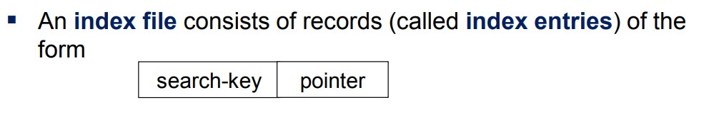

# Indexing in SQL

Indexing in a database is a technique used to speed up the retrieval of specific records from a table. 
Similar to an index at the back of a book, a database index helps locate data quickly without scanning the entire table.

## Benefits of Indexing
- Speeds up data retrieval (especially on large tables)
- Reduces disk I/O

## Indexes Term
- A search key is an attribute (or a combination of attributes) used to look up records in a database.
- 


## Types of Indexes
1. **Primary Index**: Automatically created on the primary key.
2. **Unique Index**: Prevents duplicate values.
3. **Composite Index**: Combines multiple columns for multi-column search optimization.
4. **Full-Text Index**: Optimizes text search for large text fields.

## How Indexes Work
Indexes are typically stored as B-trees or hash tables, which help the database quickly locate data.

## Example
```sql
CREATE INDEX idx_user_lastname
ON Users (last_name);
