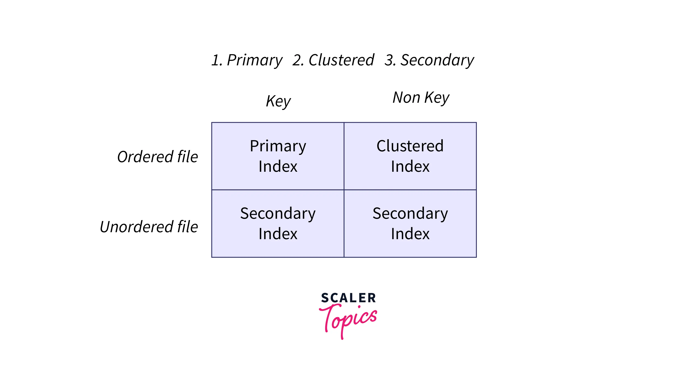

# Indexing in SQL

Indexing in a database is a technique used to speed up the retrieval of specific records from a table. 
Similar to an index at the back of a book, a database index helps locate data quickly without scanning the entire table.

## Benefits of Indexing
- Speeds up data retrieval (especially on large tables)
- Reduces disk I/O

## Indexes Term
- A search key is an attribute (or a combination of attributes) used to look up records in a database.
- 
- Index File: An index file is a smaller, separate file that stores "index entries," which consist of search keys and pointers to the actual records in the main database file.

## Types of Indices
1. **Ordered Indices**: store search keys in sorted order
2. **Hash Indices**: hash indices use a soecial function hash function to divide search keys into different groups, known as 'buckets'. Each bucket holds items with similar hash values, which makes finding exact matches very fast.

## Index Evaluation Metrics
we shall consider several techniques for ordered indexing. No techniques is best. Each technique is must be evaluated on the basis of these factors:- 
1. Access data
2. Access time
3. Insertion time
4. Deletion time
5. Space overhead

## Ordered indices have two main types:
1. Primary (Clustered) index : sorts the data by a chosen key, its often primary key but not necessarily. it can be different column. 
2. Secondary (Unclustered) index : uses search key that does not follow the main data order. thats why its called non clustering.

## Dense Index:
- Dense indexing is a database index type that includes an index record for every search key value in a database.
- There is an index entry for every record in the database.
- Dense indexing makes it to retrieve data for range based queries because of it detailed nature.
- It also requires more space to store index records which can be limitation for large databases.

## Sparse Index:
- A database index that contains an index record for only some of the search key values in the database.
- Works well if records are stored in a sequential order based on the search key.
- To find a specific record with a search key K: First, locate the index entry with the largest key that is less than K. Then, search through the file starting from this entry. (example: looking for book id-46, and the sparse index has entries for books id-10,30,50,70)
- Advantages: space efficient- uses less space.
- Trade-off : It may be slower to find specific records than a dense index, but it’s a good balance when space and maintenance are key considerations.

