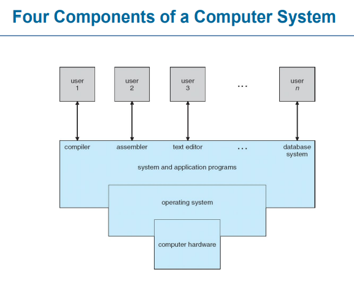
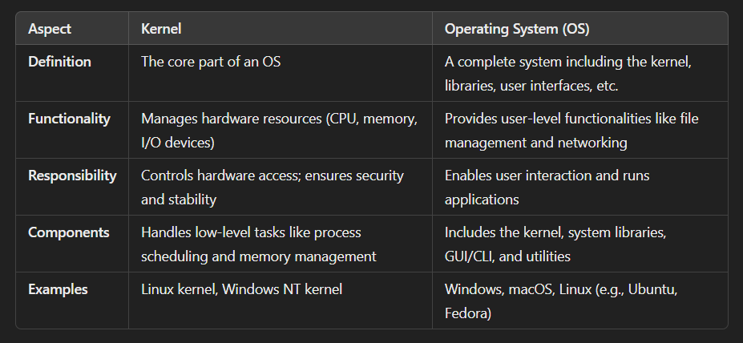
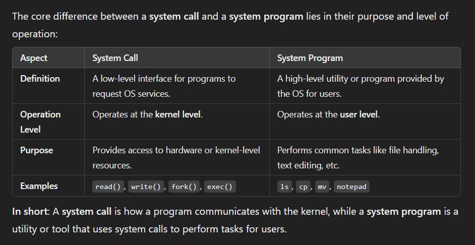
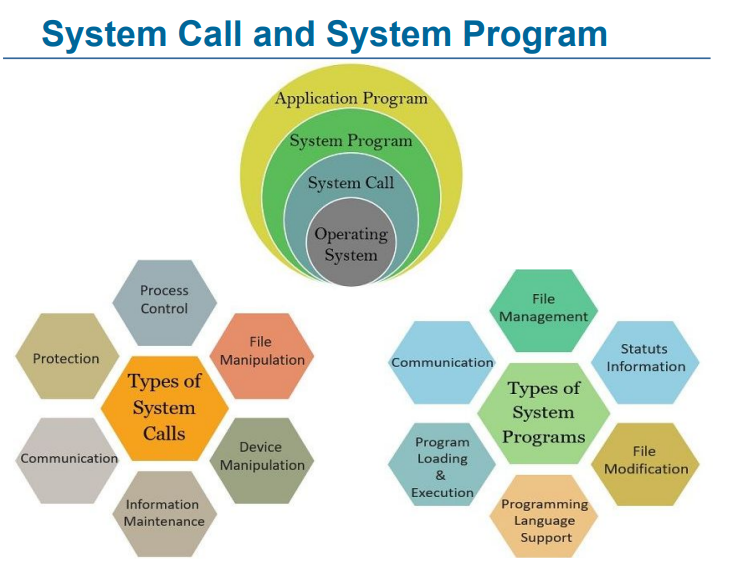
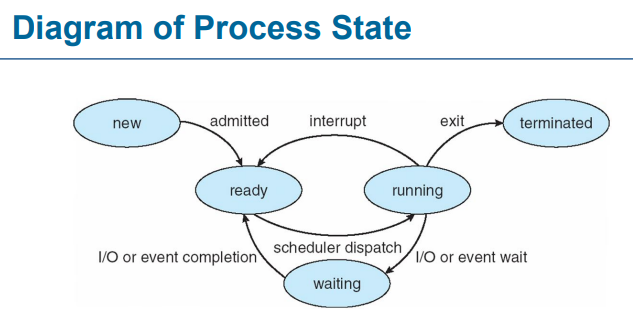
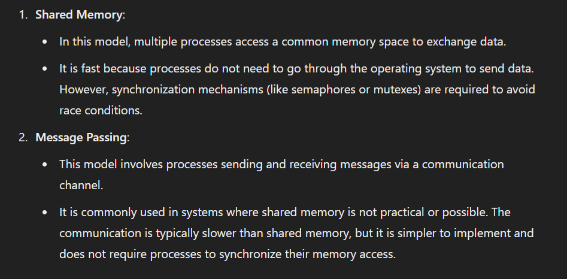
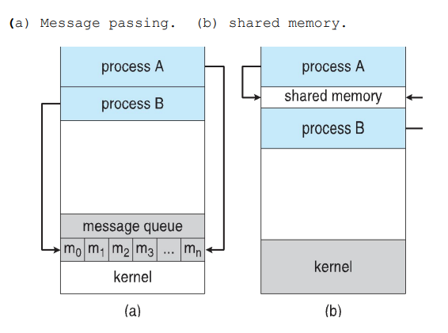

## What is an Operating System?  
● A program that acts as an intermediary between a user of a computer and the computer hardware   
   

## Operating System vs Kernel  
   

For example, kernel as the engine of a car and the OS as the entire car, including the engine, body, seats, and controls.  
When we turn on the video player to play a movie,   
the OS helps you open the video player, find the movie file, and run the app. The kernel makes sure the video player can use hardware like the GPU and speakers, and manages system resources (like memory and CPU) for everything to work smoothly. The OS is for user tasks, and the kernel handles the hardware.   

## System call vs System program   
 
   

## Process   
● Process -  a program in execution  
● Program is passive entity stored on disk (executable file), process is active  
● Program becomes process when executable file loaded into memory   
● Process State  
    ● new ● running ● waiting ● ready ● terminated   
    

## Process Control Block (PCB)  
A Process Control Block (PCB) also known as a Task Control Block, contains information about each process:  

	• Process State: Current status (running, waiting, etc.) 
	• Program Counter: Address of the next instruction to execute 
	• CPU Registers: Contents of process-specific registers 
	• Scheduling Info: Priority, queue pointers 
	• Memory Info: Allocated memory 
	• Accounting Info: CPU time used, time limits 
    • I/O Status: Devices and open files allocated to the process

   
## Process Scheduling  

Process Scheduling aims to maximize CPU usage by efficiently switching processes for time-sharing.   
Schedulers:  

	• Short-term Scheduler (CPU Scheduler): Selects the next process for CPU execution, invoked frequently (milliseconds). 
	• Long-term Scheduler (Job Scheduler): Selects processes for the ready queue, invoked infrequently (seconds, minutes), controls multiprogramming degree.
	• Medium-term Scheduling: Removes processes from memory (swapping) when the degree of multiprogramming needs to decrease.

   
## Context Switch  
	• When CPU switches to another process, the system must save the state of the old process
	• and load the saved state for the new process via a context switch
 
● Context of a process represented in the PCB  
● Context-switch time is overhead; the system does no useful work  
● While switching, the more complex the OS and the PCB  the longer the context switch  

   
## Interprocess Communication
Interprocess Communication (IPC) is a mechanism that allows processes to communicate with each other within a system  
Types of Processes:  

	• Independent Processes: These processes do not interact with other processes.
	• Cooperating Processes: These processes can affect or be affected by other processes. They typically share data or perform tasks collaboratively.

Advantages of process cooperation / cooperating Processes / IPC:   

	1. Information Sharing
	2. Computation Speedup
	3. Modularity: enhancing code reusability.
	4. Convenience: Cooperation between processes makes it easier to manage complex tasks.

● Cooperating processes need interprocess communication (IPC)  
● Two models of IPC ● Shared memory ● Message passing  

 
 

   

## Communications in Client-Server Systems
	● Sockets
	● Remote Procedure Calls
	● Pipes
	● Remote Method Invocation (Java)
  
 ● **Sockets (&ports)**   
 
	● A socket is defined as an endpoint for communication
 	● Three types of sockets: 
  
  		1. Connection-oriented (TCP): Reliable, ordered, but slower. Used for web browsing or file downloads where accuracy is essential.
    			Like making a phone call—first (Voice Calls), you dial (establish a connection), then talk (send data), and when done, you hang up (close the connection). It's reliable but has more overhead. 
    
		2. Connectionless (UDP): Faster, less reliable, and unordered. Ideal for video streaming, online gaming, where slight data loss is acceptable for real-time performance. The video stream starts transmitting immediately, without waiting for a formal connection to be established. This makes the start time faster. 
  			Like when we watch a video On-Demand Streaming (youTube, netflix), that is pre-recorded and stored on a server, we can pause, fast forward the video. Or Live Streaming (twitch, facebook Live, sports events, live video call  (real-time voice communication (like in Skype, WhatsApp, or Zoom calls)): This is real-time transmission of video content, typically not stored permanently. The content is broadcast as it's being recorded. 

		3. MulticastSocket (class): Extends the DatagramSocket class to support multicast (sending data to multiple recipients simultaneously). Used for group communication where data is sent to a multicast group address. Example: Live video broadcasts, stock market updates.

	● Concatenation of IP address and port – to uniquely identify a specific service or application running on a device
	● The socket 161.25.19.8:1625 refers to port 1625 on host 161.25.19.8
 
 	● Possible port numbers 2^16 = 65,536. 
  	● Since a 16-bit number can represent values from 0 to 65535, there are 65536 possible port numbers.
  	● However, port 0 is reserved and not typically used for regular communication.
 	● This leaves 1 to 65535 as the range of usable port numbers.
  
	● 0–1023: Well-known ports (reserved for standard services like HTTP - 80, HTTPS - 443, SSH - 22).
	● 1024–49151: These ports are registered by organizations or developers for specific applications. (For example: 3306: MySQL, 5432: PostgreSQL, 8080: Alternative HTTP)
	● 49152–65535: Dynamic/Ephemeral ports (used temporarily by clients for outbound connections).
 		Temporary Use: When a client initiates a connection (e.g., opening a web page or sending an email), the OS assigns a port from this range to uniquely identify the connection.
		Short-Lived: These ports are released and reused once the connection ends.
		Automatic Assignment: The OS dynamically selects an available port from this range without user intervention.

  		Example: A client wants to connect to a web server on port 80 (HTTP).
			Server: Listens on port 80 (fixed).
			Client: OS assigns an ephemeral port, e.g., 49160, to handle the connection.

  
 ● **Remote Procedure Call (RPC)**  
 
 	● In operating systems allows programs to run functions on other computers as if they were on the same machine  

  
 ● **Pipes**  
 
	● Pipes act as conduits(channel) for inter-process communication (IPC).
	● Unidirectional or bidirectional communication.
	● For bidirectional: half-duplex (one direction at a time) or full-duplex (simultaneous both directions).

	● Ordinary pipes are limited to unidirectional parent-child communication
	● While Named pipes offer bidirectional, more flexible, and multi-process communication, no parent-child relationship needed.
  
