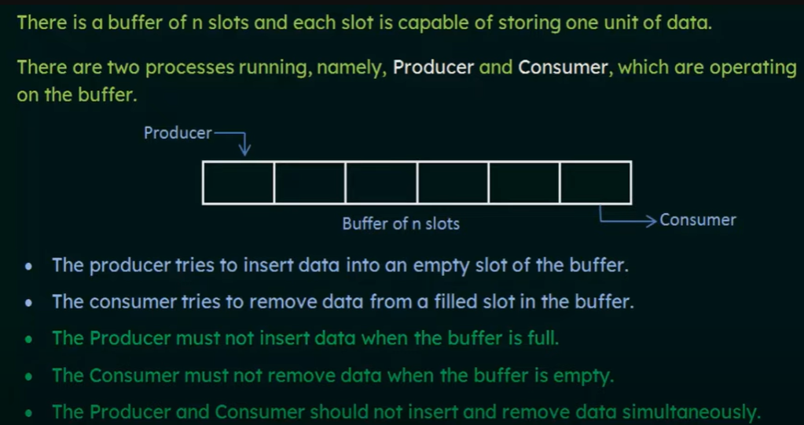
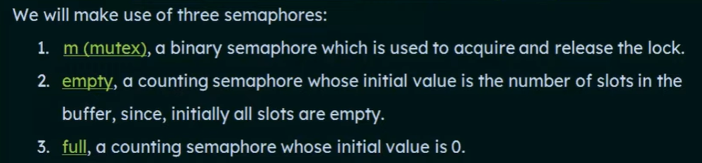
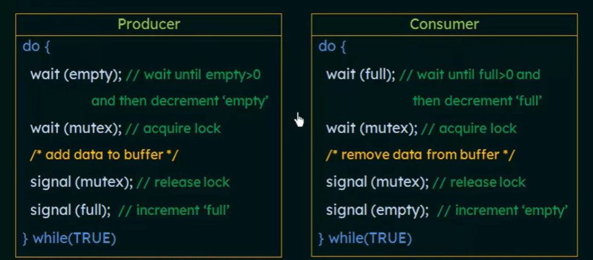
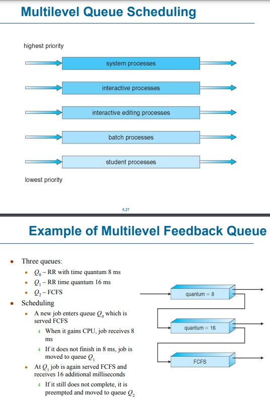

## Classical Problems of Synchronization

     

      

      

  

  

## SJF

Shortest-Job-First (SJF) Scheduling is a process scheduling methodology used in computing environments.  
It selects the process that has the smallest execution time remaining, and runs it next.  

This approach optimizes the overall time required for executing all processes by minimizing the average waiting time for all processes.  

Disadvantages of SJF Scheduling:  

	Starvation: Longer processes may never execute if shorter processes keep arriving. This issue, known as starvation, is a significant drawback in environments where process times vary greatly.

	Problem ≡ Starvation – low priority processes may never execute 

	Solution ≡ Aging – as time progresses increase the priority of the process

   

## Priority-based scheduling algorithm

less value high priority  

   
## Round Robin 
Round Robin (RR) is a CPU scheduling method where each process gets a fixed time (quantum), typically 10-100 milliseconds. After its time ends, it goes to the end of the queue. The performance depends on the size of the quantum: a large quantum makes RR similar to FIFO, while a very small one can cause high overhead due to frequent switching between processes.

   

## Multilevel Queue

Definition: The ready queue is divided into multiple fixed queues, each dedicated to a specific type of process (e.g., foreground for interactive processes, background for batch processes). Processes are permanently assigned to one queue based on their type.  

Key Characteristics:  

	Each queue has its own scheduling algorithm:
	Foreground: Round Robin (RR)
	Background: First-Come, First-Served (FCFS)
	Inter-Queue Scheduling:
	Fixed Priority: Higher priority for foreground; can lead to background process starvation.
	Time Slice: CPU time divided among queues (e.g., 80% for foreground, 20% for background).

  
## Multilevel Feedback Queue
Definition: An advanced version of the multilevel queue where processes can move between queues based on their behavior and requirements. Aging can be used to prevent starvation.  

Key Characteristics:  

	Dynamic Movement: Processes may be promoted or demoted across queues.
	Parameters:
	Number of queues.
	Scheduling algorithm for each queue.
	Criteria for promotion, demotion, and initial queue assignment.
	Flexible and adaptive, ensuring a balance between CPU and I/O-bound processes.

     

