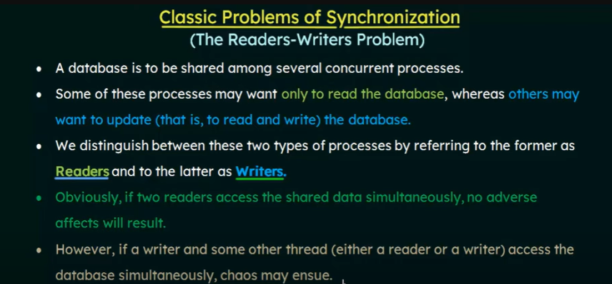
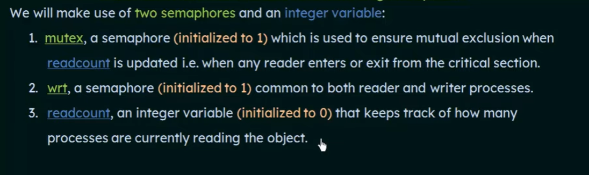
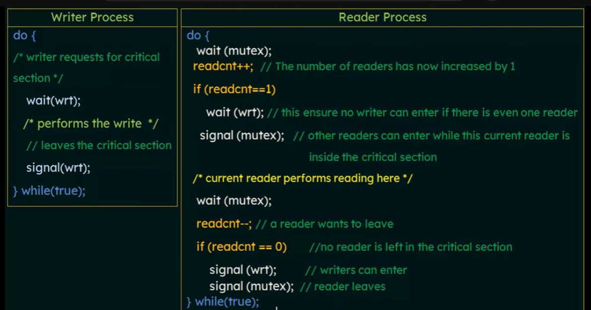
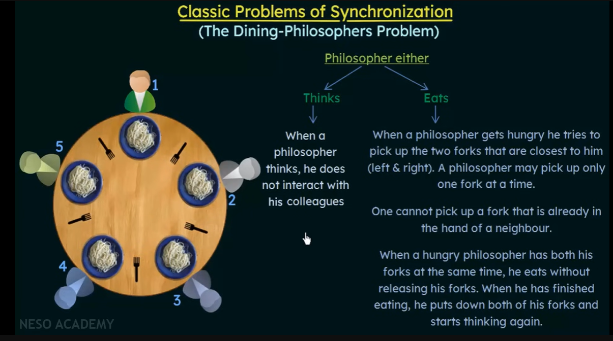
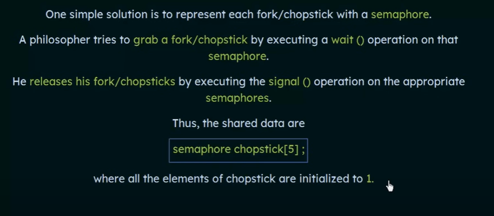

## Producer Consumer Problem

## Classical Problems of Synchronization: 

**Bounded-Buffer Problem**   

     

      

      

  

**The Readers Writers Problem**   

     

     

     

**Dining Philosophers Problem**   

     

     
