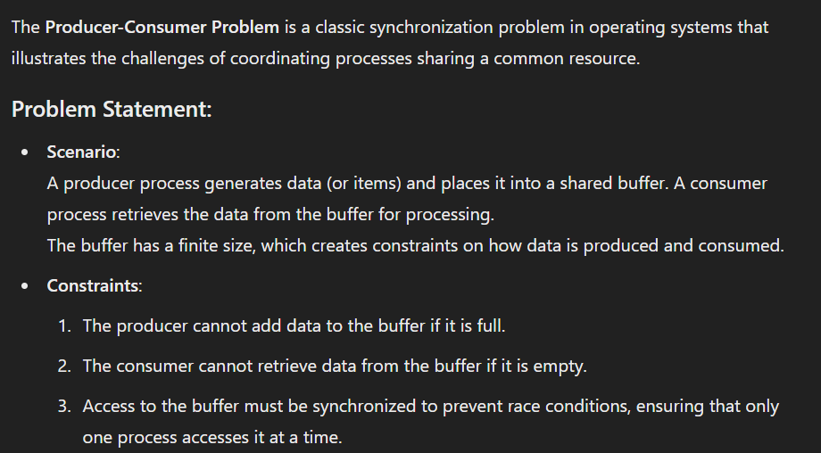
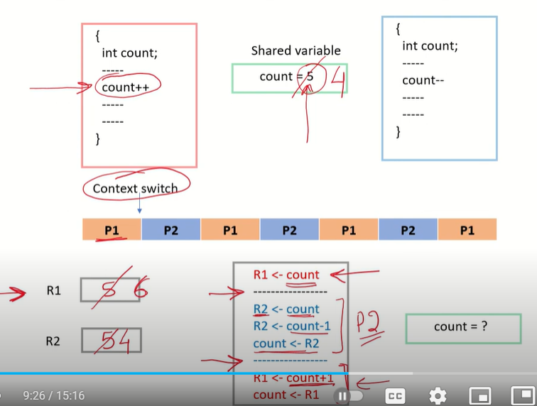
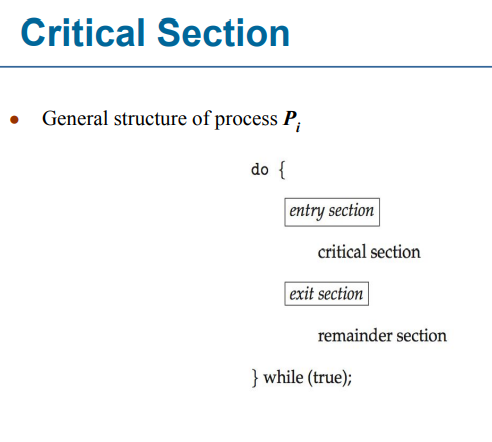
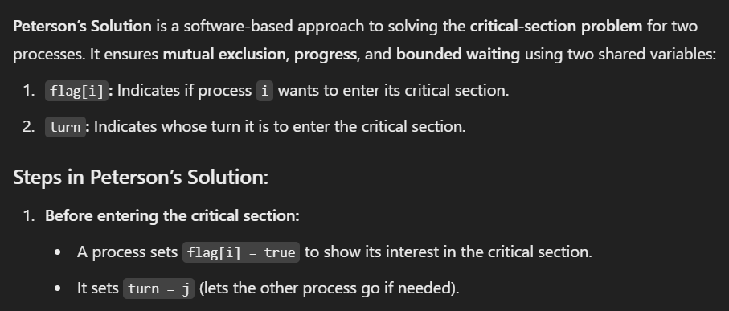
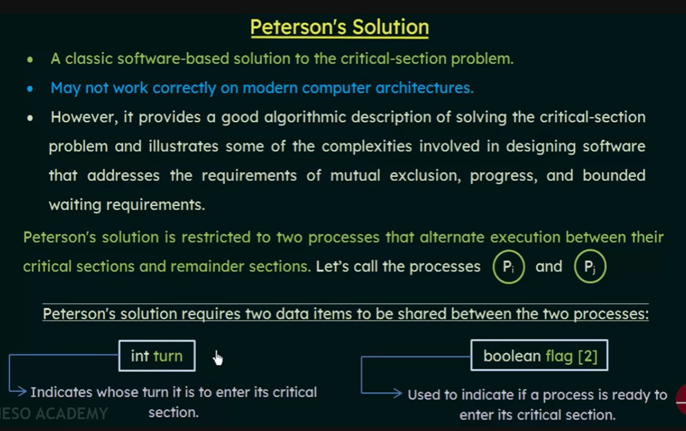
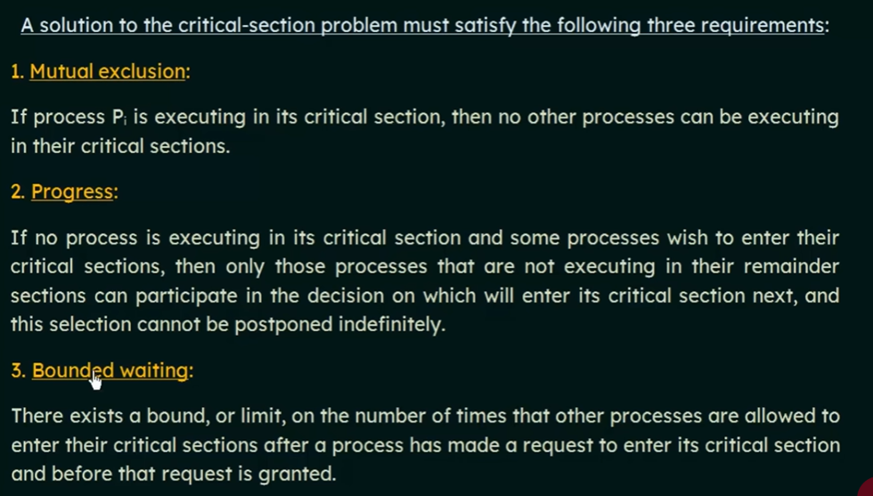
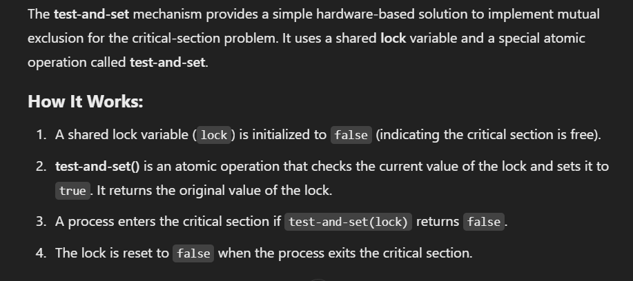
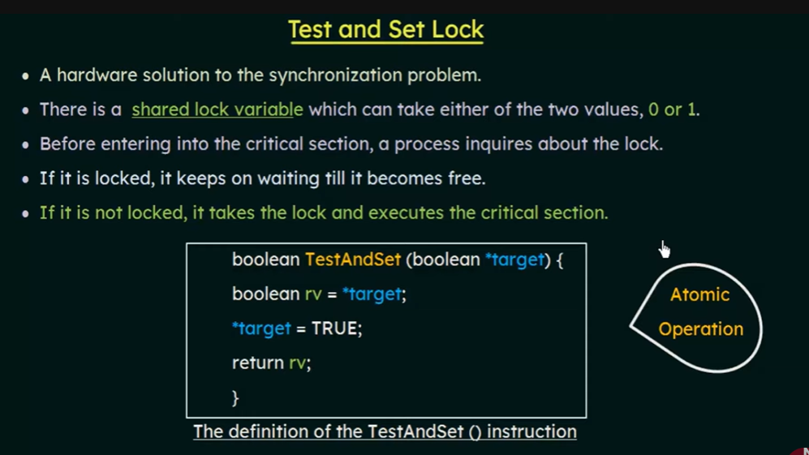
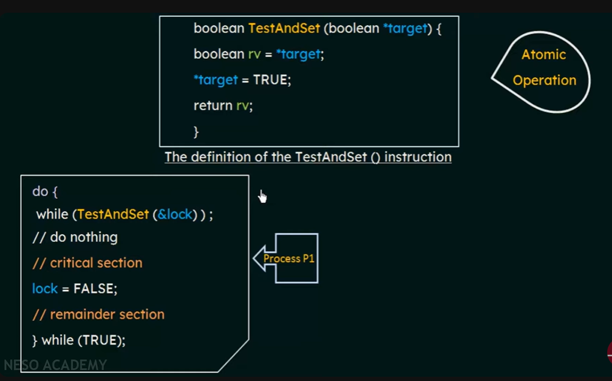

**chapter 6**

## Producer Consumer Problem

    

## Race Condition

Race Condition: A race condition occurs when two or more processes access a shared resource and attempt to modify it simultaneously, leading to unpredictable or incorrect results.  

It happens when processes do not follow proper synchronization.  

    

## Critical Section

A critical section in an operating system is a segment of code or a region of a program that accesses shared resources (variables, files, or data structures) and must not be accessed by more than one process at the same time. This is crucial to prevent data inconsistency or race conditions.  
Each process must ask permission to enter critical section in entry section, may follow critical section with exit section, then remainder section  

    

## Solution to Critical-Section Problem

    1. Mutual Exclusion: If a process executing in its critical section,no other processes can be executing in their c. sections
    
    2. Progress: If no process is executing in its critical section and there exist some processes that wish to enter their 
       critical section,then the selection of processes that will enter the critical section next can't be postponed indefinitely
                  
    3. Bounded Waiting: A bound must exist on the number of times that other processes are allowed to enter their critical 
       sections after a process has made a request to enter its critical section and before that request is granted

         

### Peterson's Solution (Humble algorithm)

    
    
    
   
**Peterson's Algorithm satisfies all three conditions of synchronization**     
      

### test_and_set lock Solution

**Atomic operation: A single operation that cannnot be interrupted by anyone**

    
    
    

Test-and-Set Lock provides Mutual Exclusion and ensures Progress, but it does not inherently guarantee Bounded Waiting. This limitation arises because processes may experience starvation due to its reliance on busy-waiting. To achieve Bounded Waiting, further mechanisms like priority-based scheduling or fairness algorithms are necessary.

     

### Semaphore Solution

A semaphore is a synchronization tool that allows a fixed number of threads to access a shared resource at the same time. 

**Binary Semaphore:**

    Definition: A semaphore with a value of 0 or 1, used to control access to shared resources.
    Behavior: wait(mutex) decrements the value (blocks if it's already 0).
              signal(mutex) increments the value (unblocks a waiting process if it's 0).

 

**Counting Semaphore:**
    
    Used to manage access to a resource with multiple instances.
    The semaphore's value represents the number of available instances of the resource.
    When a process requests access (wait operation), the semaphore is decremented.
    When a process releases the resource (signal operation), the semaphore is incremented.
    If the semaphore's value is greater than 0, processes can access the resource. 
    If the value reaches 0, processes must wait until another process releases the resource.

    If there are 3 instances of a resource, up to 3 processes can access it simultaneously. 
    When a 4th process tries to access, it will be blocked until one of the current processes releases the resource.

 

**Main difference between a counting semaphore and a binary semaphore**   

    Counting semaphore can hold values greater than 1, typically used to manage access to a pool of resources. 
    The value of the semaphore represents the number of available resources.  
    Allows multiple threads/processes to access a limited number of shared resources. 

    while 
    Binary Semaphore holds only two values 0 or 1. Acts as a lock or signal mechanism. 
    It allows only one thread/process to access a shared resource at a time.
    
    A binary semaphore is simpler and can often be used as a mutex, 
    whereas a counting semaphore provides more flexibility for managing multiple resources.
    
  

**Mutex:** is similar like binary semaphore in our syllabus.   

    Definition: A mutual exclusion lock used specifically to protect critical sections.
    Behavior: Only the thread that locks (enters the critical section) can unlock it.
    Usage: Designed solely for mutual exclusion.

   
## Classical Problems of Synchronization: 

**Bounded-Buffer Problem**   

     

      

      

  

**The Readers Writers Problem**   

     

     

     

**Dining Philosophers Problem**   

     

     
